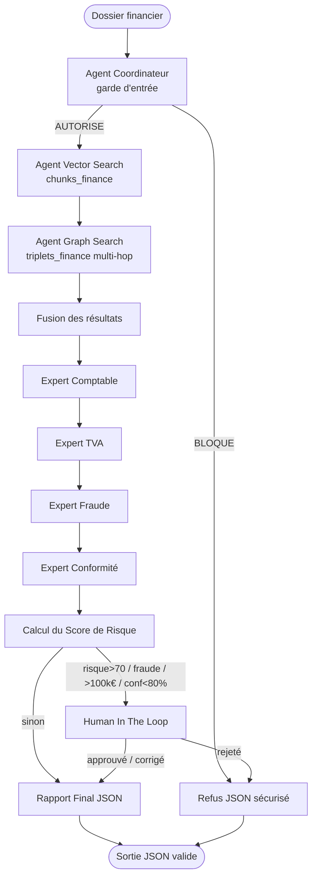
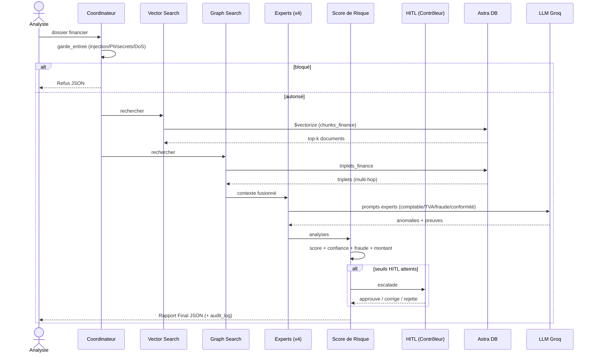
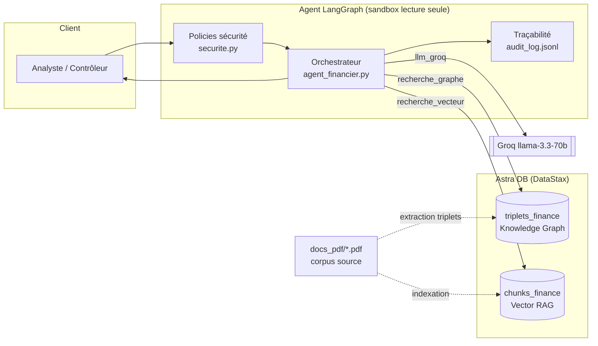
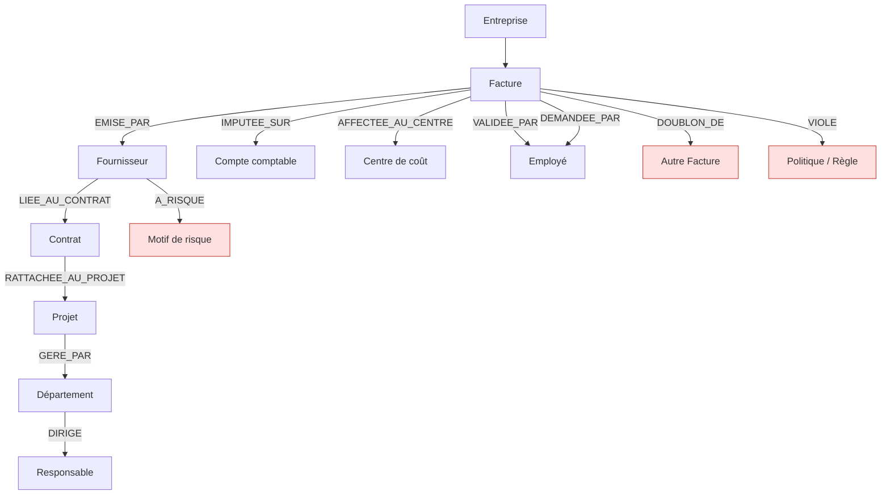

# Diagrammes — Agent Finance Hybride V1

## 1. Flowchart — pipeline de l'agent

## 2. Sequence Diagram

## 3. Architecture Diagram

## 4. Knowledge Graph — modèle de données (multi-hop)

**Chemin multi-hop illustratif détecté par l'agent :**
`FAC-2026-102 → EMISE_PAR → MegaConsulting → A_RISQUE → offshore non agréé`
puis `FAC-2026-117 → DOUBLON_DE → FAC-2026-102` et
`FAC-2026-102 → DEMANDEE_PAR / VALIDEE_PAR → Omar Chraibi` (auto-validation).
